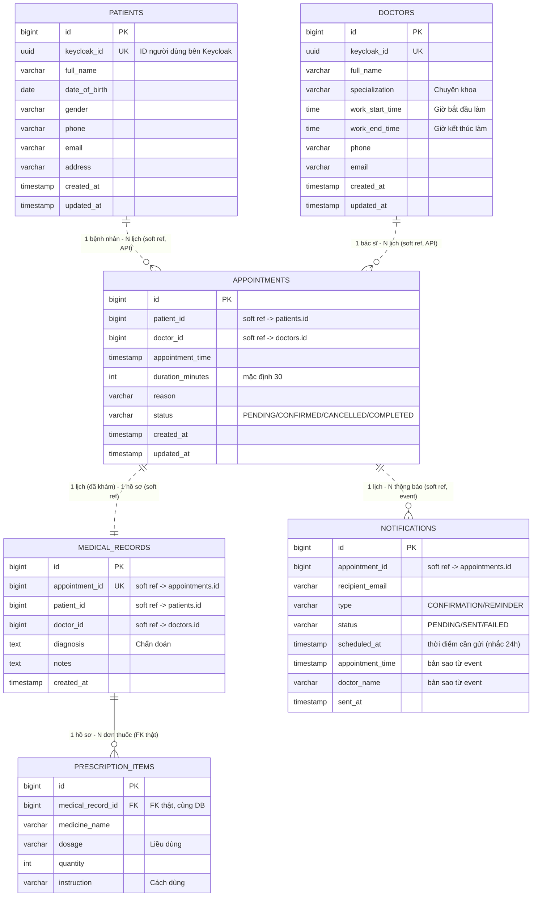

# ERD — Hệ thống Đặt lịch khám bệnh (Microservice)

**Phiên bản:** 1.0 | **Ngày:** 21/07/2026

> **Nguyên tắc microservice:** mỗi service có **1 database riêng**. Không có khóa ngoại (FK) nối cứng giữa 2 database khác nhau.
> - `——` (đường liền): **FK thật**, chỉ tồn tại **trong cùng 1 database**.
> - `··`  (đường đứt): **tham chiếu mềm** — chỉ lưu con số ID của service khác, lấy dữ liệu bằng **gọi API / nghe event**, KHÔNG phải FK.

---

## 1. Bản đồ Database ⇄ Service

| Service | Database | Bảng |
|---------|----------|------|
| patient-service | `patient_db` | `patients` |
| doctor-service | `doctor_db` | `doctors` |
| appointment-service | `appointment_db` | `appointments` |
| medical-record-service | `medical_record_db` | `medical_records`, `prescription_items` |
| notification-service | `notification_db` | `notifications` |

---

## 2. ERD tổng thể (Mermaid)



---

## 3. Vì sao lại là "tham chiếu mềm"?

`appointments.patient_id` chỉ lưu **con số** (VD: `42`). Nó KHÔNG join được sang bảng `patients` vì bảng đó nằm ở database khác (`patient_db`).

Khi appointment-service cần tên bệnh nhân, nó **gọi API** của patient-service:
```
GET http://patient-service/api/patients/42
```

Riêng notification-service **không gọi API mỗi lần** mà lưu sẵn bản sao (`appointment_time`, `doctor_name`) lấy từ **event Kafka** lúc đặt lịch — để job nhắc lịch 24h chạy độc lập, không phụ thuộc service khác còn sống hay không.

---

## 4. Chỉ số (Index) nên tạo — cho hiệu năng

| Bảng | Index | Lý do |
|------|-------|------|
| `appointments` | `(doctor_id, appointment_time)` | Truy vấn chống trùng lịch (BR-01) chạy nhanh |
| `appointments` | `(patient_id)` | Lấy danh sách lịch của 1 bệnh nhân |
| `medical_records` | `(appointment_id)` unique | 1 lịch chỉ 1 hồ sơ |
| `patients` / `doctors` | `(keycloak_id)` unique | Map user đăng nhập sang hồ sơ |
| `notifications` | `(status, scheduled_at)` | Job quét mail cần gửi |
```
