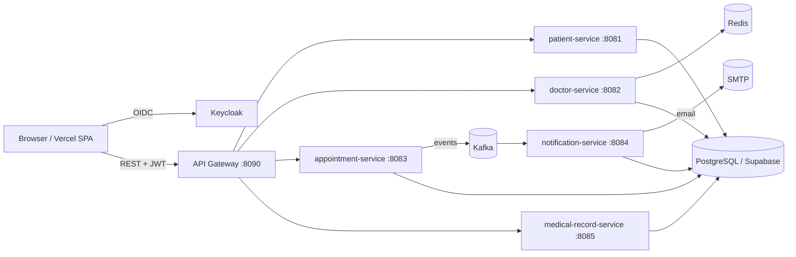

# MediBook — Healthcare Appointment Booking

A microservices healthcare booking platform: patients find doctors and book
appointments, doctors manage their schedule and write medical records, and admins
oversee everything with analytics. Built with Spring Boot microservices, a React
SPA, and Keycloak-based authentication.

> **Frontend demo:** https://healthcare-rosy-eta.vercel.app
> (the backend runs behind a Cloudflare Tunnel; it must be online for login/data)

---

## Tech stack

**Backend** — Java 21, Spring Boot 4.1.0 (Maven multi-module)
- Spring Cloud Gateway (WebFlux) as the single entry point / JWT resource server
- Spring Data JPA + PostgreSQL (Supabase, Singapore region)
- Apache Kafka (KRaft) for async notifications, Redis for caching + rate-limiting
- OpenPDF for medical-record / prescription PDF export

**Frontend** — React 19 + Vite, Tailwind CSS v4
- `keycloak-js` (OIDC, PKCE), axios, React Router
- i18n (Vietnamese / English) + light/dark theme

**Auth & Infra** — Keycloak 26 (realm `healthcare`, Google login + username/password),
Docker Compose, Cloudflare Tunnel, Vercel (frontend hosting)

---

## Architecture



Each service owns its data and talks to others through the gateway or direct
service-to-service REST calls (with a service-account token). The gateway verifies
the Keycloak JWT before routing; per-role and per-owner rules live in each service.

| Service | Port | Responsibility |
| --- | --- | --- |
| api-gateway | 8090 | Routing, JWT verification, CORS, rate-limiting |
| patient-service | 8081 | Patient profiles |
| doctor-service | 8082 | Doctors, working hours, leave, ratings, avatars |
| appointment-service | 8083 | Booking, reschedule, cancel, statistics |
| notification-service | 8084 | Kafka consumer → email + reminders |
| medical-record-service | 8085 | Medical records, prescriptions, PDF export |
| security-service | 8086 | Access events, alerts, IP blocks (optional) |

---

## Features

- **Patients** — Google / account login, find doctors by specialty, book & reschedule
  & cancel appointments, view records, rate doctors, download record/prescription PDFs.
- **Doctors** — monthly calendar + upcoming list, confirm / complete appointments,
  write medical records, manage leave days.
- **Admins** — manage doctors & patients, view all appointments (cancel with a reason
  that is emailed to the patient, view details), analytics dashboard.
- **Cross-cutting** — VI/EN i18n, light/dark theme, forgot/change password (Keycloak),
  email notifications & 24h reminders.

**Booking rules** enforced server-side include: no past bookings, within the doctor's
working hours, not on a doctor's leave day, no double-booked doctor slot, and
**at most one appointment per doctor per day per patient**.

---

## Project layout

```
backend/            Spring Boot multi-module (one module per service + api-gateway)
frontend/           React + Vite SPA (feature-based structure under src/)
infrastructure/
  keycloak/         Keycloak production stack + realm-config + export tooling
  vps/              Caddy reverse-proxy + compose overrides for a public-IP VPS
docs/               Deployment & operations notes
PRD-Healthcare-Booking.md, ERD-Healthcare-Booking.md
```

---

## Getting started (local development)

### Prerequisites
- Java 21, Maven 3.9+
- Node.js 20+
- Docker Desktop (for Keycloak, Kafka, Redis)
- A PostgreSQL database (e.g. a free Supabase project)

### 1. Auth — Keycloak
Bring up Keycloak (realm `healthcare` is imported automatically):
```bash
docker compose -f infrastructure/keycloak/compose.yaml up -d
```
See `infrastructure/keycloak/README.md` for realm export/import and secrets.

### 2. Backend
Each service reads DB credentials from its own `secrets.yaml` (gitignored). Then:
```bash
docker compose -f backend/compose.yaml --env-file backend/.env up -d --build
```
Copy `backend/.env.example` → `backend/.env` and fill Supabase / Keycloak / mail values.
Services also run individually from an IDE (Maven) for development.

### 3. Frontend
```bash
cd frontend
cp .env.example .env      # point VITE_KEYCLOAK_URL / VITE_API_URL at your gateway
npm install
npm run dev               # http://localhost:3000
```

---

## Configuration

Secrets are never committed. Templates:
- `backend/.env.example` — datasources, Keycloak issuer, Kafka/Redis, SMTP
- `frontend/.env.example` — `VITE_API_URL`, `VITE_KEYCLOAK_URL`, realm/client
- Per-service `secrets.example.yaml`

## Deployment

- **Frontend** → Vercel (root directory `frontend`; see `frontend/vercel.json`).
- **Backend + Keycloak** → any Docker host. Two documented paths:
  - **Cloudflare Tunnel** from a machine without a public IP (`--profile cloudflare`).
  - **VPS with a public IP** using Caddy for automatic HTTPS — see `infrastructure/vps/`.

## Documentation
- Product requirements: `PRD-Healthcare-Booking.md`
- Entity-relationship design: `ERD-Healthcare-Booking.md`
- Keycloak / deployment: `infrastructure/keycloak/README.md`, `docs/`
